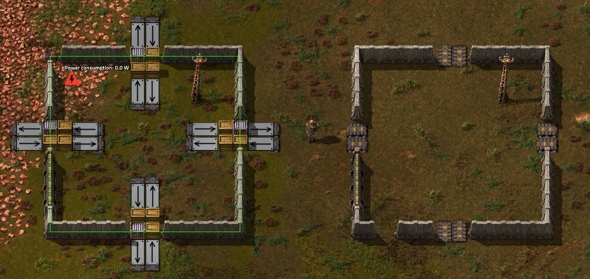

# Factory modules

Massive modular factories without cheats or UPS issues

## Why

Factorio allows you to build bases that grow forever. Eventually you reach the dreaded UPS limit. Once that happens, you have to look into your options:

1. Mods that make entities produce more (feels like cheating)

2. Mods that attempt to hide the low UPS by increasing speeds

3. Scaling to multiple computers (clusterio)

This mod is designed to be a 4th option. It aims to allow groups of vanilla entities to be deactivated to not consume clock cycles while still producing.
Gameplay should still feel vanilla - builds will have the same footprints, ratios, number of entities in their construction and designs.

## How

To start you create a border around a rectangular area with stone walls. This is your primary production area.
Resources are only allowed to move in and out through the wall using loaders and chests.
By blueprinting the area you can create clones of it. The clones won't simulate the movement of the internal entities, but will sync their input and output with the primary production area.

Each area is called a `module`. A module keeps track of all the wall, chest and combinator entities it consists of. When a wall entity is destroyed the module breaks.

The module ID is stored in a constant combinator. ID namespaces are seperate for each size of modules. One module is declared the "primary" module - it is the only module that is simulated by the game engine. Entities are mirrored to "secondary" modules as ghosts. Secondary modules are only "active" when they contain no ghosts.

## Usage

Install the mod. Build a rectangle out of walls, gates and transport belts. The transport belts will be used as input and output devices.

Placing the final wall on the right hand side completes the module, turning it into the view on the right.

There are 2 types of modules: Primary and secondary.

Primary modules have their contained entitites running as normal. The border around primary modules are highlighted green. Items are passed through the IO ports on belts. Power draw is calculated as the maximum draw for machines in the primary module.

Secondary modules are copies of the primary created by blueprints or the copy paste function. They cannot be rotated compared to the primary module. All entities inside a secondary module are set to inactive, meaning entities can't move and don't take update time. The input and output of the module mirrors that of the primary module.

Secondary modules have an `active` status - it will only mirror the primary module when it is active. The following things can cause a secondary module to go inactive:

* Lack of power
* Entities not connected to the power network
* Blueprint ghosts/items marked for deconstruction
* Logistic network entities - disabled to prevent cheating

Once active it will look like this:

## Vanilla compatibility

Factory modules is designed to be as close to vanilla as possible. To convert your factory to a fully vanilla version for benchmarking, use `/migrate_to_vanilla` 

To convert back, use `/migrate_from_vanilla`

## Limitations

To keep the performance impact low a few sacrifices have been made.

* Power is not calculated proportionally to assembler activity
* The production graph does not show intermediate items produced in secondary modules

## Development setup

Symlink the repository folder to your factorio install for development:

    mklink /D C:\Users\danielv\AppData\Roaming\Factorio\mods\factory_modules C:\Users\danielv\Documents\project_files\factory_modules

Install dependencies:

    npm install

Build the mod:

    npm run build
